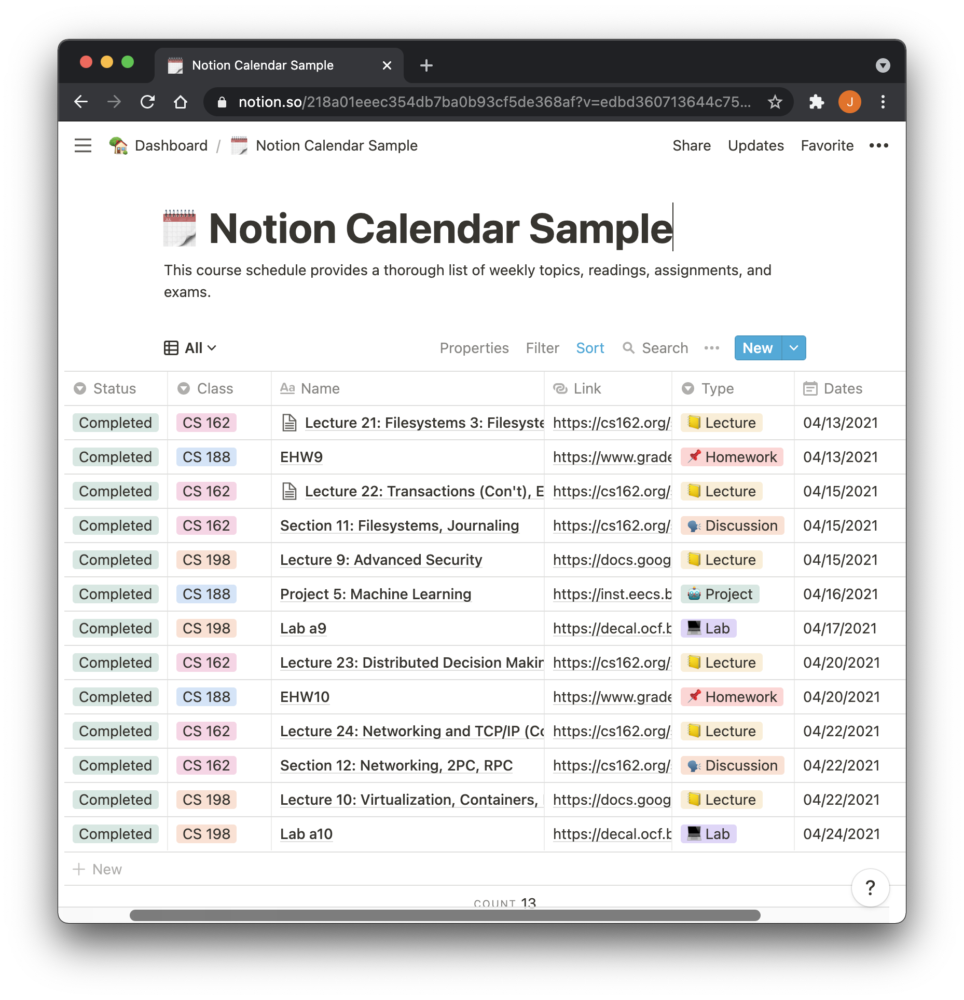
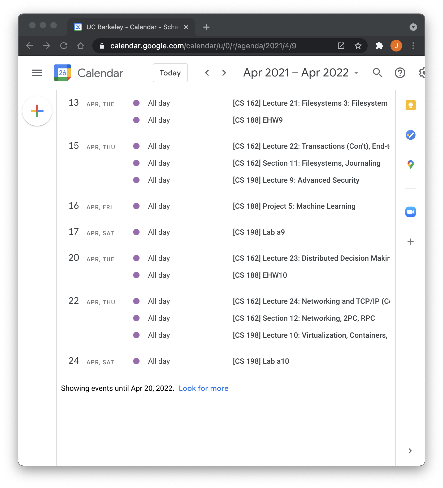
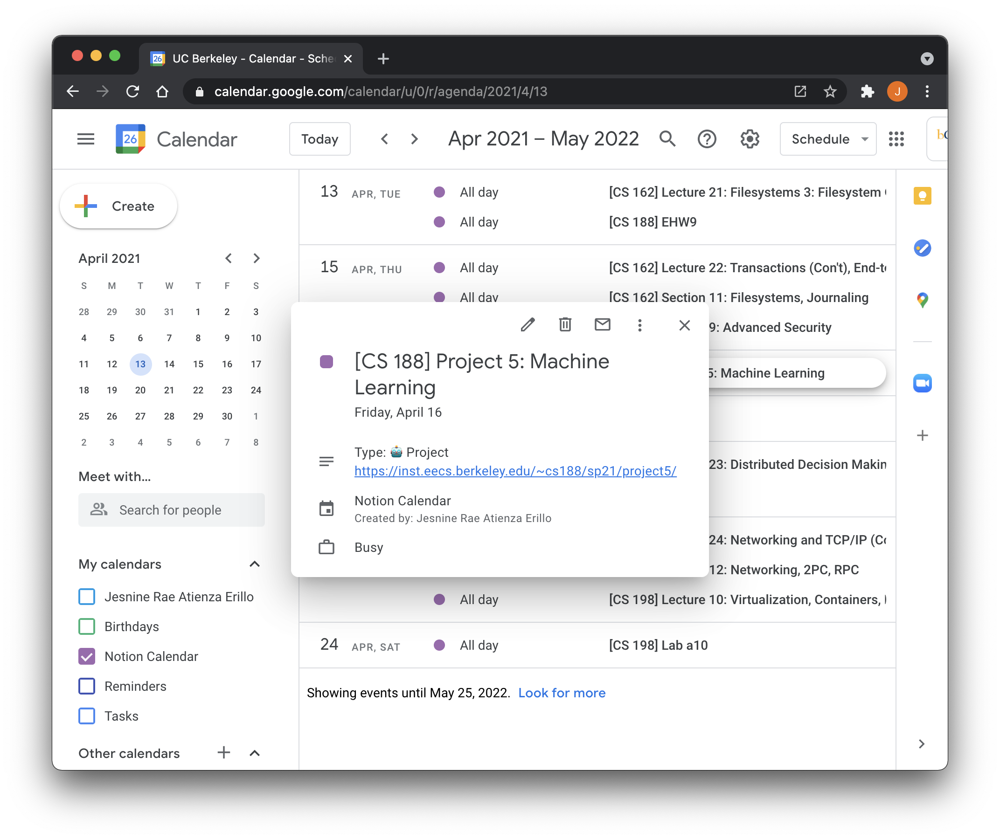

# Notion Calendar

**Author: Jesnine Erillo**

I just wanted to play around with Notion's public API :)

This automates Google Calendar event creation from a Notion Database.

The code here is customized for my specific Notion database that I use for keeping track of my coursework, and it utilizes the following properties:

- `Name`: title of the assignment
- `Class`: which class the assignment is for
- `Link`: url of the assignment
- `Type`: what kind of assignment it is
- `Dates`: the dates that the assignment is due

---

## References

- Notion API Reference: [https://developers.notion.com/reference](https://developers.notion.com/reference)
- Google Calendar API Reference: [https://googleapis.dev/nodejs/googleapis/latest/calendar/classes/Calendar.html](https://googleapis.dev/nodejs/googleapis/latest/calendar/classes/Calendar.html)

## Run Locally

1. Fill out the variables in `.env.example` with your `NOTION_TOKEN` and `DATABASE_ID`. Follow the instructions on the [Notion API Reference](https://developers.notion.com/reference) to retrieve these values. Then rename the file to `.env`.
2. Create a client secret JSON file called `credentials.json` by following these directions: [Create Desktop application credentials](https://developers.google.com/workspace/guides/create-credentials#desktop). **This will be used by Google Calendar API for authentication.**
3. Run: `node app.js`

## Usage Limits

There are usage limits that limits how frequently I can use the Google Calendar API, including the number of events I can create :(

## Preview

### Side-by-side

|            Notion             |             Calendar              |
| :---------------------------: | :-------------------------------: |
|  |  |

### Event Details

The event details is also populated using fields from the database. As you can see below, the description includes the type and link. The event title is also prepended with the class that this event is for (e.g. "[CS 188]").

